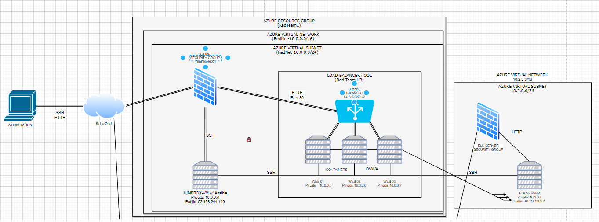
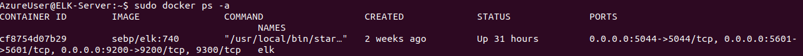

## Automated ELK Stack Deployment

The files in this repository were used to configure the network depicted below.

These files have been tested and used to generate a live ELK deployment on Azure. They can be used to either recreate the entire deployment pictured above. Alternatively, select portions of the playbook file may be used to install only certain pieces of it, such as Filebeat.

  

This document contains the following details:
- Description of the Topology 
- Access Policies
- ELK Configuration
  - Beats in Use
  - Machines Being Monitored
- How to Use the Ansible Build

### Description of the Topology

The main purpose of this network is to expose a load-balanced and monitored instance of DVWA, the D*mn Vulnerable Web Application.

- Load balancing ensures that the application will be highly responsive, in addition to restricting the network from being overburdened.
- Load balancers are extremely affected again DDOS attacks as they can shift traffic and data around to free space. 
- Jump Boxes are also extremely helpful in keeping your network safe as it is the sole computer at the heart of things to ensure safety.

Integrating an ELK server allows users to easily monitor the vulnerable VMs for changes to the Network and Operating system.

- Filebeat will monitor logs that are being saved on the servers.
- Metricbeat will both monitor and calculate metrics and statistics from the server followed by putting them into a report.

The configuration details of each machine may be found below.

| Name     | Function | IP Address | Operating System |
|----------|----------|------------|------------------|
| Jump Box | Gateway  | 10.0.0.4   | Linux            |
| Web 01   | Network  | 10.0.0.5   |  Linux           |
| Web 02   | Network  | 10.0.0.6   |    Linux         |
| Web 03   | Network  | 10.0.0.7   |     Linux        |

### Access Policies

The machines on the internal network are not exposed to the public Internet. 

Only the Jumpbox machine can accept connections from the Internet. Access to this machine is only allowed from the following IP addresses:
- 52.158.244.146

Machines within the network can only be accessed by the JumpBoxProvisioner.
- JumpboxProvisioner @ 52.158.244.146

A summary of the access policies in place can be found in the table below.

| Name     | Publicly Accessible | Allowed IP Addresses       |
|----------|---------------------|----------------------------|
| Jump Box |     No              | 10.0.0.5 10.0.0.6          |

### Elk Configuration

Ansible was used to automate the configuration of the ELK machine. No configuration was performed manually, which is advantageous because...
- Without being in the Elk Stack you're able to configure it.
- You're also able to maintain and manage the Elk Stack much easier.

The playbook implements the following tasks:
- Install Docker so that containers can be configured in the Elk Server.
- Install Python3 and install docker within Python3.
- Set the virtual memory to increase automatically when the Elk server boots up.
- Download and Launch a docker container for the Elk server.
- Enable the created docker container. 

The following screenshot displays the result of running `docker ps` after successfully configuring the ELK instance.

### Target Machines & Beats
This ELK server is configured to monitor the following machines:
- Web-01 10.0.0.5
- Web-02 10.0.0.6
- Web-03 10.0.0.7

We have installed the following Beats on these machines:
- Filebeat
- Winlogbeat
- Metricbeat
- Auditbeat

These Beats allow us to collect the following information from each machine:
All of these beats are very similar in the sense that some will collect files, metrics, and data on specific applications or just in general. Some will also log events and collect information regarding such. 

### Using the Playbook
In order to use the playbook, you will need to have an Ansible control node already configured. Assuming you have such a control node provisioned: 

SSH into the control node and follow the steps below:
- Copy the filebeat-config.yml file to /etc/ansible.
- Enter the Elk VM IP Address into the filebeat-config.yml file.
- Run the playbook, and go to http://10.2.0.4:5601/app/kibana to check whether or not the installation worked. 

- Copy the Filebeat configuration file from your Ansible container to your WebVM's. Then place the configuration file in your Ansible directory.
- Once placed in a directory on the WebVM run ansible-playbook filebeat-playbook.yml.
- 20.36.205.207:5601/app/kibana#/home/tutorial/systemLogs?_g=0 (Check Data)
